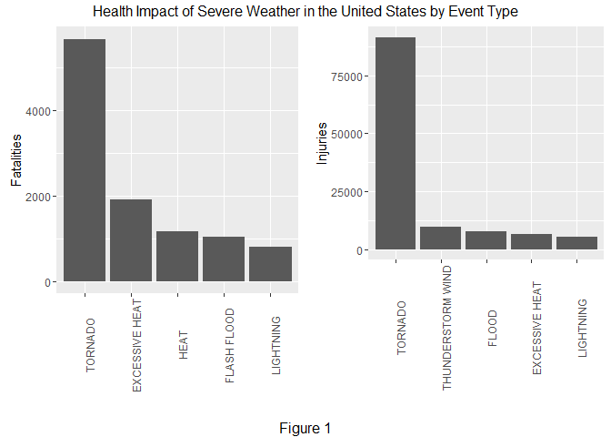
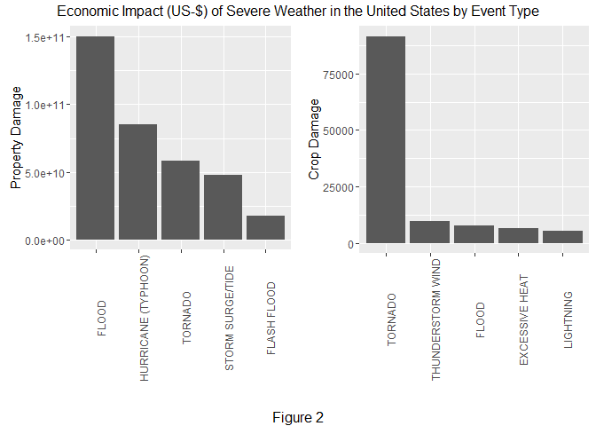

# Health and Economic Impact of Severe Weather in the United States
# Synopsis
The basic goal of this data analisys is to explore a published data set from the NOAA - National Weather Service Severe Storm Database, and address the following questions about severe weather events:

1. Across the United States, which types of events (as indicated in the EVTYPE variable) are most harmful with respect to population health?
2. Across the United States, which types of events have the greatest economic consequences?

The questions are answered using the published copy of the [NOAA Storm Database](https://d396qusza40orc.cloudfront.net/repdata%2Fdata%2FStormData.csv.bz2) 
The R code used to support the analysis is provided. The analysis output includes tables, figures and other summaries.

This dataset consists of 902297 observations of 37 variables, seven of which directly support the goals of the data analysis, with an eighth to facilitate "tidying" the data.

# Data Processing

This section describes how the data were obtained, loaded into R and processed for analysis.
- the compressed CSV file (bzip2 format) containing the data was downloaded from its published location.
- the raw data was uncompressed and loaded using the read.csv function
- The cache = TRUE option was set to optimize the development and analysis process.

## Obtaining and loading the data

One of the students noted that if your default locale is not English, some of the multi-line remarks cause incorrect loading of the data. The Sys.setlocale statement is intended to remediate that issue.


```r
Sys.setlocale("LC_ALL", "English") 
```

```
## [1] "LC_COLLATE=English_United States.1252;LC_CTYPE=English_United States.1252;LC_MONETARY=English_United States.1252;LC_NUMERIC=C;LC_TIME=English_United States.1252"
```

```r
require(markdown)
```

```
## Loading required package: markdown
```

```
## Warning: package 'markdown' was built under R version 3.2.5
```

```r
require(knitr)
```

```
## Loading required package: knitr
```


```r
setwd("~/GitHub/RepData_PeerAssessment2")
download.file("https://d396qusza40orc.cloudfront.net/repdata%2Fdata%2FStormData.csv.bz2","repdata%2Fdata%2FStormData.csv.bz2")
stormData<-read.csv("repdata%2Fdata%2FStormData.csv.bz2")
```

# Pre-processing

To facilitate the analysis, we take following steps:

## Select variables for analysis

Create a subset of the original data, keeping eight variables.

+ EVTYPE
+ FATALITIES
+ INJURIES  
+ PROPDMG
+ PROPDMGEXP
+ CROPDMG
+ CROPDMGEXP 
+ REMARKS

```r
sdata <- data.frame(stormData[,c(8,23, 24, 25,26, 27,28,36)], stringsAsFactors = FALSE)
```
## Evaluate the data to ensure usability

In order to aggregate the values associated with health and economic impact of severe weather in the United States, we need to normalize the values based on the \*DMG and associated \*DMGEXP values.

```r
levels(stormData$PROPDMGEXP)
```

```
##  [1] ""  "-" "?" "+" "0" "1" "2" "3" "4" "5" "6" "7" "8" "B" "h" "H" "K"
## [18] "m" "M"
```

```r
summary(stormData$PROPDMGEXP)
```

```
##             -      ?      +      0      1      2      3      4      5 
## 465934      1      8      5    216     25     13      4      4     28 
##      6      7      8      B      h      H      K      m      M 
##      4      5      1     40      1      6 424665      7  11330
```

```r
stormData$PROPDMG[(stormData$PROPDMGEXP %in% c("?", "-", "+"))]
```

```
##  [1] 20 20  2  0 15 60  0  0 15  0  0  0  0  0
```

```r
levels(stormData$CROPDMGEXP)
```

```
## [1] ""  "?" "0" "2" "B" "k" "K" "m" "M"
```

```r
summary(stormData$CROPDMGEXP)
```

```
##             ?      0      2      B      k      K      m      M 
## 618413      7     19      1      9     21 281832      1   1994
```

```r
stormData$CROPDMG[(stormData$CROPDMGEXP %in% c("?", "-", "+"))]
```

```
## [1] 0 0 0 0 0 0 0
```


## Tidy up the \*EXP and EVTYPE variables
### Tidy \*EXP

In the previous step we observed that the number of \*EXP values in the vector, c( "", "?", "+", "-") were very low. Based on the number of occurrences and the corresponding \*DMG values, we can safely assign an value of 0 (zero) to non-alphanumeric \*EXP values.

Transform the \*DMGEXP values into *integer* values that correspond to base 10 order of magnitude exponents. The alpha characters are assigned values based on conventional representation of orders of magnitude (hundreds, thousands, millions, billions). 

We then calculate the normalized damage values.


```r
# Ensure that the *EXP variables are of class "character" (vs. "factor")
     sdata$PROPDMGEXP<-as.character(sdata$PROPDMGEXP)
     sdata$CROPDMGEXP<-as.character(sdata$CROPDMGEXP)

# Transform the *EXP values to enable arithmetic operations     
     sdata$PROPDMGEXP[(sdata$PROPDMGEXP %in% c("B", "b"))] <-9
     sdata$PROPDMGEXP[(sdata$PROPDMGEXP %in% c("M", "m"))] <-6
     sdata$PROPDMGEXP[(sdata$PROPDMGEXP %in% c("K", "k"))] <-3
     sdata$PROPDMGEXP[(sdata$PROPDMGEXP %in% c("H", "h"))] <-2
     sdata$PROPDMGEXP[(sdata$PROPDMGEXP %in% c("", "?", "-", "+"))] <-0

     sdata$CROPDMGEXP[(sdata$CROPDMGEXP %in% c("B", "b"))] <-9
     sdata$CROPDMGEXP[(sdata$CROPDMGEXP %in% c("M", "m"))] <-6
     sdata$CROPDMGEXP[(sdata$CROPDMGEXP %in% c("K", "k"))] <-3
     sdata$CROPDMGEXP[(sdata$CROPDMGEXP %in% c("H", "h"))] <-2
     sdata$CROPDMGEXP[(sdata$CROPDMGEXP %in% c("", "?", "-", "+"))] <-0

# convert *DMGEXP values to class "integer"" and calculate the normalized damage values 
     sdata$PROPDMGEXP<-as.integer(sdata$PROPDMGEXP)
     sdata$CROPDMGEXP<-as.integer(sdata$CROPDMGEXP)

     sdata$PROPDMGVAL <- sdata$PROPDMG * 10^sdata$PROPDMGEXP
     sdata$CROPDMGVAL <- sdata$CROPDMG * 10^sdata$CROPDMGEXP
```
### Tidy EVTYPE

The Event Type data contains a number of occurences that appear to be mis-spellings. The list of valid types can be found in the [National Weather Service Storm Data Documentation](https://d396qusza40orc.cloudfront.net/repdata%2Fpeer2_doc%2Fpd01016005curr.pdf) 

1. Create and load a file containing the an *UPPER CASE* set of valid values from the NOAA documentation.
2. Convert all EVTYPE values to *UPPER CASE* to eliminate ambiguity.
3. Trim extraneous spaces from the beginning and end of the values.
4. Create a set of unique occurrences of the EVTYPE values.
5. Load the set of NOAA standard event types (they have already been set to *UPPER CASE*).
6. Determine which observations have invalid EVTYPE values.
    + Divide the sum the relevant metrics with invalide event types by the corresponding total
    + Decide whether the values of the metric data are of sufficient magnitude to warrant cleaning the EVTYPE values (> 5%).


```r
require(stringr)
```

```
## Loading required package: stringr
```

```
## Warning: package 'stringr' was built under R version 3.2.5
```

```r
sdata$EVTYPE <- toupper(sdata$EVTYPE)
sdata$EVTYPE <- str_trim(sdata$EVTYPE)
uev2 <- data.frame(unique(sdata$EVTYPE))

uev<-read.csv("NOAA_EVTYPES.csv")
sdata$INVALID_EVTYPE_IND <- 1
sdata$INVALID_EVTYPE_IND[(sdata$EVTYPE %in% uev$EVTYPE)] <- 0
sdata$OB<-1
sum(sdata$INVALID_EVTYPE_IND)
```

```
## [1] 266942
```

```r
fie<-sum(sdata$FATALITIES[(sdata$INVALID_EVTYPE_IND==1)])
fTotal<-sum(sdata$FATALITIES)
fie/fTotal
```

```
## [1] 0.1378013
```

```r
iie<-sum(sdata$INJURIES[(sdata$INVALID_EVTYPE_IND==1)])
iTotal<-sum(sdata$INJURIES)
iie/iTotal
```

```
## [1] 0.0984359
```

```r
pdie<-sum(sdata$PROPDMGVAL[(sdata$INVALID_EVTYPE_IND==1)])
pdTotal<-sum(sdata$PROPDMGVAL)
pdie/pdTotal
```

```
## [1] 0.3561145
```

```r
cdie<-sum(sdata$CROPDMGVAL[(sdata$INVALID_EVTYPE_IND==1)])
cdTotal<-sum(sdata$CROPDMGVAL)
cdie/cdTotal
```

```
## [1] 0.2946034
```

The percentage of the values of each of the metrics is greater than 5%, so it is advisable to "tidy up" the EVTYPE values.

Take a first cut at matching the sdata$EVTYPE values with the NOAA Standard EVTYPE values using a tool like Excel. The formulas are intact in the column, "NOAA\_EVTYPE\_FIRST\_CUT\_DO\_NOT\_USE\_IN\_ANALYSIS". Note the Excel file:
 [EVTYPE_MAP.xlsx](https://github.com/whbrown555/RepData_PeerAssessment2/blob/master/EVTYPE_MAP.xlsx) 

Review the EVTYPE data resolving ambiguities with common sense and references to the REMARKS variable.

- Load the EVTYPE_MAP file
- Merge it with the analysis data on EVTYPE
- Quality check to make sure that none of the original EVTYPE values were missed.


```r
evtypeMap<-read.csv("EVTYPE_MAP.csv")
tidy_sdata <- merge(evtypeMap,sdata,all.y = TRUE)
sum(is.na(tidy_sdata$NOAA_EVTYPE))
```

```
## [1] 0
```


# Analysis

We now have a "tidy" data frame and can perform the analysis needed to answer the questions posed.

Aggregate the data by event type and set the factors to facilitate analysis of impact type by event type.


```r
# aggregate the data by the "tidy" event type for each of the impact types associated with health or economic impact.
# Health - Fatalities
dead <- aggregate(FATALITIES ~ NOAA_EVTYPE, data = tidy_sdata, FUN = sum)
dead$IMPACT_TYPE <- "FATALITIES"
colnames(dead)<- c("NOAA_EVTYPE","IMPACT_VAL","IMPACT_TYPE")
dead$NOAA_EVTYPE <- factor(dead$NOAA_EVTYPE, 
                           levels = dead$NOAA_EVTYPE[order(-dead$IMPACT_VAL)])
dead<-dead[order(-xtfrm(dead$IMPACT_VAL),dead$NOAA_EVTYPE),]
rownames(dead)<-seq(1:nrow(dead))

# Health - Injuries
wounded <- aggregate(INJURIES ~ NOAA_EVTYPE, data = tidy_sdata, FUN = sum)
wounded$IMPACT_TYPE <- "INJURIES"
colnames(wounded)<- c("NOAA_EVTYPE","IMPACT_VAL","IMPACT_TYPE")
wounded$NOAA_EVTYPE <- factor(wounded$NOAA_EVTYPE, 
                           levels = wounded$NOAA_EVTYPE[order(-wounded$IMPACT_VAL)])
wounded<-wounded[order(-xtfrm(wounded$IMPACT_VAL),wounded$NOAA_EVTYPE),]
rownames(wounded)<-seq(1:nrow(wounded))

# Economic - Property Damage
property <- aggregate(PROPDMGVAL ~ NOAA_EVTYPE, data = tidy_sdata, FUN = sum)
property$IMPACT_TYPE <- "PROPDMGVAL"
colnames(property)<- c("NOAA_EVTYPE","IMPACT_VAL","IMPACT_TYPE")
property$NOAA_EVTYPE <- factor(property$NOAA_EVTYPE, 
                           levels = property$NOAA_EVTYPE[order(-property$IMPACT_VAL)])
property<-property[order(-xtfrm(property$IMPACT_VAL),property$NOAA_EVTYPE),]
rownames(property)<-seq(1:nrow(property))

# Economic - Crop Damage
crops <- aggregate(CROPDMGVAL ~ NOAA_EVTYPE, data = tidy_sdata, FUN = sum)
crops$IMPACT_TYPE <- "CROPDMGVAL"
colnames(crops)<- c("NOAA_EVTYPE","IMPACT_VAL","IMPACT_TYPE")
crops$NOAA_EVTYPE <- factor(crops$NOAA_EVTYPE, 
                           levels = crops$NOAA_EVTYPE[order(-crops$IMPACT_VAL)])
crops<-crops[order(-xtfrm(crops$IMPACT_VAL),crops$NOAA_EVTYPE),]
rownames(crops)<-seq(1:nrow(crops))
```

# Results

The ggplot2, grid and gridExtra packages were used to plot the relationship between weather event types and impact.

## Health Impact

As indicated in Figure 1, below, health impacts (life and limb) are clearly dominated by *"Tornado"* class events. I believe that this would have emerged whether the EVTYPE varriable had been "tidied" or not.

```r
require(ggplot2)
```

```
## Loading required package: ggplot2
```

```
## Warning: package 'ggplot2' was built under R version 3.2.5
```

```r
require(grid)
```

```
## Loading required package: grid
```

```r
require(gridExtra)
```

```
## Loading required package: gridExtra
```

```
## Warning: package 'gridExtra' was built under R version 3.2.5
```

```r
# Health Impact Analysis
gg1<- ggplot(dead[1:5,], aes(x = NOAA_EVTYPE, y = IMPACT_VAL)) 
gg1<- gg1 + geom_bar(stat = "identity")
gg1<- gg1 + xlab("")
gg1<- gg1 + ylab("Fatalities")
gg1<- gg1 + theme(axis.text.x = element_text(angle=90))

gg2<- ggplot(wounded[1:5,], aes(x = NOAA_EVTYPE, y = IMPACT_VAL)) 
gg2<- gg2 + geom_bar(stat = "identity")
gg2<- gg2 + xlab("")
gg2<- gg2 + ylab("Injuries")
gg2<- gg2 + theme(axis.text.x = element_text(angle=90))

grid.arrange(gg1, gg2, ncol = 2, top = "Health Impact of Severe Weather in the United States by Event Type", bottom = "Figure 1")
```



## Economic Impact

Figure 2, below, shows that *serious flooding* events (vs. Flash flooding, small streams, etc.) render the greatest overall economic impact, driven primarily by property damage value in particular. 
While not impacting the overall economic impact as dramatically, crop damage, on the other hand, suffers its greatest impact from *tornadoes*. 

## explore the relationships using  ggplot


```r
# Economic Impact Analysis
gg1<- ggplot(property[1:5,], aes(x = NOAA_EVTYPE, y = IMPACT_VAL)) 
gg1<- gg1 + geom_bar(stat = "identity")
gg1<- gg1 + xlab("")
gg1<- gg1 + ylab("Property Damage")
gg1<- gg1 + theme(axis.text.x = element_text(angle=90))

gg2<- ggplot(wounded[1:5,], aes(x = NOAA_EVTYPE, y = IMPACT_VAL)) 
gg2<- gg2 + geom_bar(stat = "identity")
gg2<- gg2 + xlab("")
gg2<- gg2 + ylab("Crop Damage")
gg2<- gg2 + theme(axis.text.x = element_text(angle=90))

require(grid)
require(gridExtra)
grid.arrange(gg1, gg2, ncol = 2, top = "Economic Impact (US-$) of Severe Weather in the United States by Event Type", bottom = "Figure 2")
```


